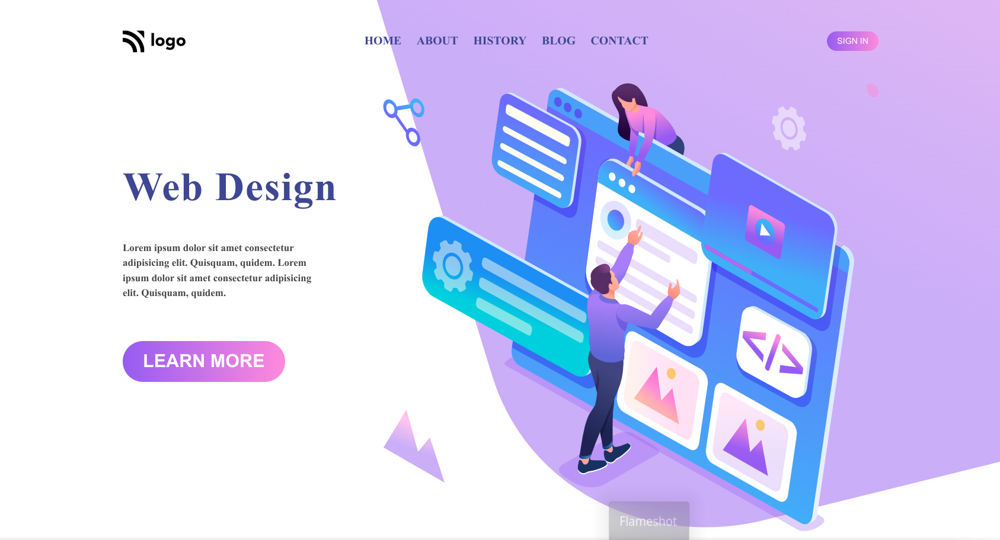

# Design-Web

# Design Web

> Project 8

<table>
<tr>
<td>
  A landing page designed using pure HTML & CSS.
</td>
</tr>
</table>

### Skills Gained from this

- Learned about CSS Positioning, Relative, Absolute. Also  how to use negative values to adjust the items as desired`.
- Learned about linear-gradient and how it can only be applied to background property and not backround-color.

### Screenshot

## Device support

The site is compatible with desktop/laptop screens only.

## Author

